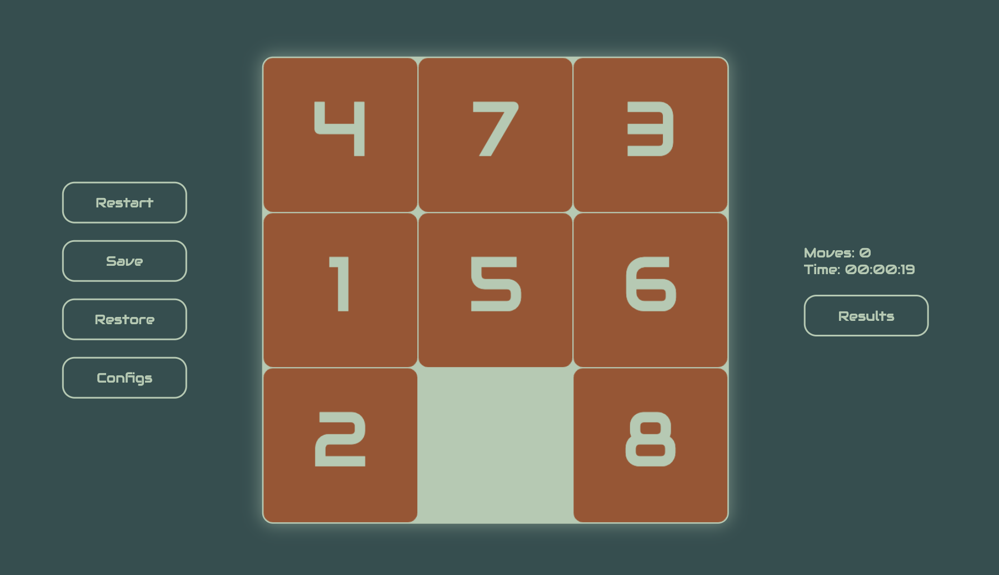

# Sliding Gem Puzzle game

- **Stack:** Vanilla JS, HTML, SCSS, Webpack

## Features:

- **Theme Change:** Enjoy the game in Dark and Light mode, adapting to your preference and enhancing your gaming experience.

- **Drag-N-Drop:** Effortlessly control the tiles by using intuitive mouse movements, allowing smooth and precise interactions.

- **Flexible Size:** Adjust the puzzle size from 3x3 up to 10x10, providing a range of difficulty levels to challenge your puzzle-solving skills.

- **Responsive Design:** Experience the game seamlessly across various devices, ensuring optimal gameplay even on screens as small as 320 pixels.

- **Made with Canvas:** The game is meticulously designed using the power of HTML5 Canvas, delivering a visually appealing and engaging gaming experience.

- **Save and Restore Progress:** Your progress is automatically saved in LocalStorage, allowing you to continue the game at any time without losing your achievements.

- **Top 10 Results:** Compete with yourself and others by achieving the best scores for each puzzle size. The top 10 results for each tile size are conveniently saved in LocalStorage.

- **Immersive Sound Effects:** Immerse yourself in the game with realistic sound effects, including satisfying move sounds and a triumphant winning sound that adds excitement to your victories.

Experience the Sliding Gem Puzzle game and test your puzzle-solving skills with its captivating gameplay, delightful visuals, and seamless user experience.

[Play Now!](https://gem-puzzle-canvas.netlify.app/)
